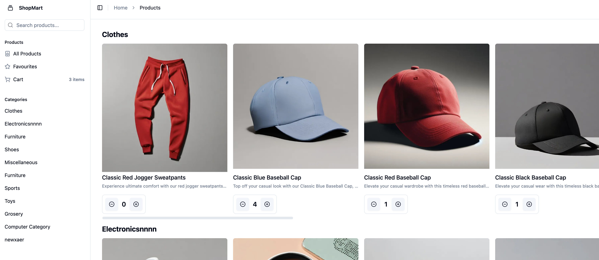

# ShopMart

This project is created as a requirement for passing Module 4 which is part of the Second Milestone on RevoU Fullstack Engineering Course. I'm Riki form the 4th team on Paris section.

## Project Goals
- [ ] Create a user-friendly online shopping experience using core React functionalities.
- [x] Implement user authentication, product management, and effective routing.
- [x] Utilize APIs to fetch and display data within your application.
- [ ] Implement robust testing methodologies to ensure application reliability.
- [ ] Enhance the application using Next.js features and advanced routing techniques.
- [ ] Manage data effectively, including authentication and integration of middleware.

## Installation
This project is powered by [Vite](vite.dev), and all the script require to go up and running are available in the `package.json` file. 

To install dependencies:
```shell
npm install
```

To run the project in development mode:
```shell
npm run dev
```

To build production code:
```shell
npm run build
```

## Overview
This is the source code for ShopMart, an Online Shop built on top of [Platzi Fake Store API](https://fakeapi.platzi.com/). The project is built using [React](https://react.dev/), with baked in technologies:
- browser router using [React Router](https://reactrouter.com/)
- authentication and registration powered by [Platzi Fake Store API](https://fakeapi.platzi.com/)
- custom hooks
- react contexts
- lazy-loaded image with fallback
- data cleanup and validation

## Features
- A landing page, which showcase top products and categories available
- A product detail page
- A product list page with filter
- Login and Register page

## Preview
The website is under active maintenance, and it currently looks really ugly, but bear with me, this is going to be improved in near future, aesthetic are just not the current priorty.

;

## Live website
The website is deployed on [Vercel](https://vercel.com/), and live website available at [https://shopmart-ashen.vercel.app/](https://shopmart-ashen.vercel.app/)
